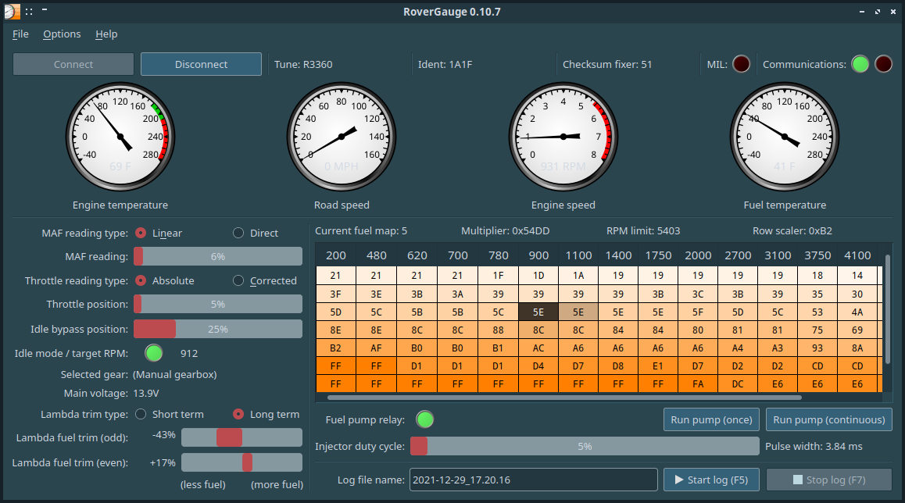
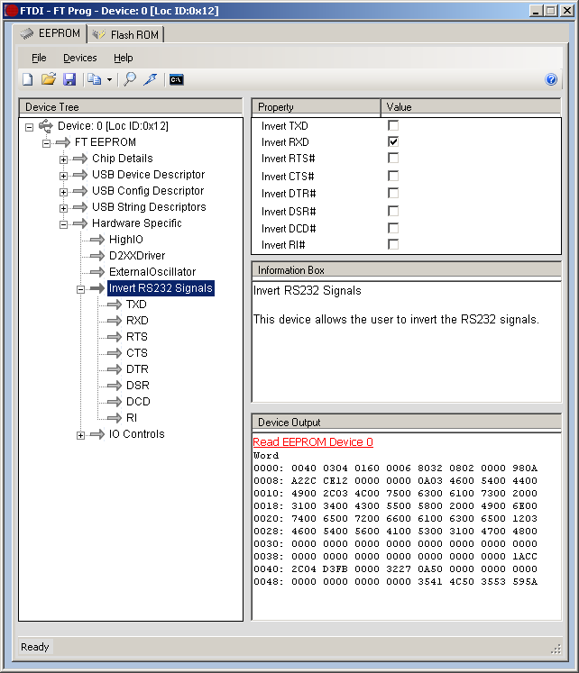
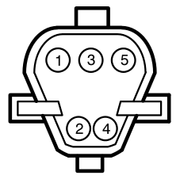
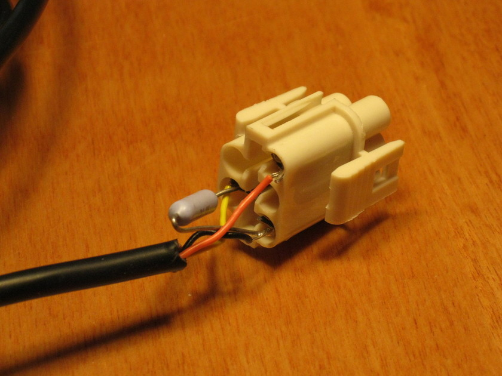
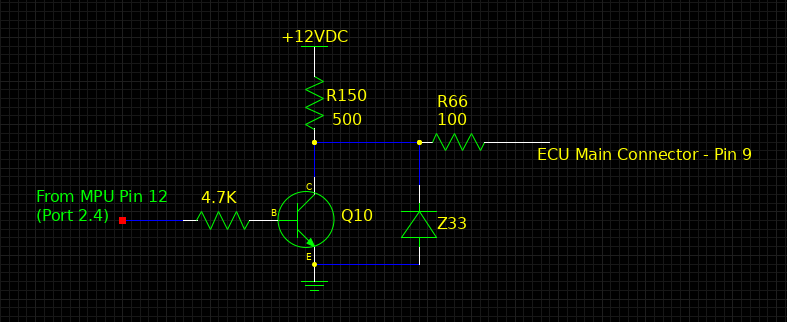

# RoverGauge

RoverGauge is a graphical display and diagnostic tool that reads runtime data from a Lucas 14CUX engine management system. The 14CUX was paired with the Rover V8 engine in Land Rover vehicles from 1990 to 1995, and also in sports cars made by low-volume automakers (TVR, Morgan, etc.) throughout the 1990s.

RoverGauge depends on another piece of software that I wrote, libcomm14cux. Each of these two projects has its own GitHub repository:

 - https://github.com/colinbourassa/rovergauge
 - https://github.com/colinbourassa/libcomm14cux

## License

RoverGauge is licensed under the GPL v3. See the file "LICENSE" for details.

## Disclaimer

While this software has been shown to be reliable and is provided in good faith, it is provided with ABSOLUTELY NO WARRANTY.

## Installing and running

If you're running Windows, the simplest way to get started is to download the Win32 binary archive. Most people will probably want to do this. If you have a 64-bit version of Windows, get the file with ``Windows-x86_64`` in the name; for 32-bit, get ``Windows-i686``. The archive contains the RoverGauge executable, Qt libraries, and libcomm14cux library, all of which are required to run.

If you're running Linux, you can get a Debian package (.DEB) for your system's architecture.

 - https://github.com/colinbourassa/rovergauge/releases/latest

It's also possible to build RoverGauge from the code yourself. This can be done with Linux or Windows. In either case, you'll need CMake (version 3 or newer) as well as version 5.x of the Qt SDK.

## Building interface cable

For RoverGauge to do anything useful, the computer on which it's running must be connected to the serial port in the 14CUX wiring harness. This requires building a custom cable based on a 5-volt FTDI USB-to-serial chip. Either the [TTL-232R-5V-WE](http://www.mouser.com/ProductDetail/FTDI/TTL-232R-5V-WE/?qs=OMDV80DKjRpkYYDGO9eaujGTH0wnKdmG) or the [TTL-232R-5V](http://www.mouser.com/ProductDetail/FTDI/TTL-232R-5V/?qs=OMDV80DKjRrD9MyCA82%252bP%252bSWgdIEaA5p) works fine. (If you don't get the wire-ended ("-WE") cable, you'll need to cut the header connector off the end before attaching your own connector.) There are also other manufacturers that build cables using FTDI chips; I've successfully tested the similar [Gearmo cable](https://www.gearmo.com/shop/usb-to-ttl-232r-5v-ftdi-cable-open-wired-end/). When using one of these cables, the software will set the correct baud rate automatically.

On the cables I've used, the Tx and Rx lines were orange and yellow, respectively. Check the documentation for your cable to be sure about the wiring.

Once you have the FTDI cable, it's a good idea to test it with a loopback: short the Tx and Rx lines, connect the USB end to a PC, and start a terminal emulator (such as [PuTTY](http://www.chiark.greenend.org.uk/~sgtatham/putty/), if you're running Windows.) Be sure to turn off local echo, and any characters you type should appear in the terminal.

Then, using the [FT\_PROG utility from FTDI](https://ftdichip.com/utilities/#FT_PROG), invert the polarity of the Rx line (see screenshot) and program the new configuration to the device (by selecting ``Devices`` -> ``Program`` or simply pressing ``Ctrl-P``). After this, unplug and re-plug the USB end of the FTDI cable for the change to take effect.

If you're using Linux, you can use the [ft232r\_prog utility](http://rtr.ca/ft232r/) instead of the Windows-only FT\_PROG utility.

A loopback test in a terminal should no longer work once the Rx line is inverted.

### Connector and wiring

The wiring harness in most 14CUX-equipped vehicles already has a beige 5-pin connector on the serial port lines. It's a "TTS"-type ("Total Terminal Security") connector, which was used on many British vehicles until the mid-1990s, but the mating shell is no longer available from retailers. You may want to purchase a more common pair of mating connectors (such as a DB9), and use these instead. If you want to retain the original 5-pin connector on the vehicle's wiring harness, you can splice a different one in parallel.

The serial connector in the vehicle is usually located in the cabin. In the 1993 Range Rover (NAS), it is under the passenger seat; in the 1994 Defender (NAS), it is behind the passenger footwell kickpanel; in the 1994 Discovery (NAS), it is below the glovebox. **Note:** From model year 1993 to 1995 (with the exception of the 1993 SWB), the Range Rover Classic used an electronic air suspension system. On these vehicles, the air suspension ECU has a diagnostic port with a TTS connector as well. Be sure that you are using the port for the engine ECU.

In most vehicles, the connector is mated to a grounding plug (i.e. the mating half of the connector with a pin installed to ground the ECU's Rx line.) You need to remove the grounding plug before connecting your FTDI cable.

**Important:** When you attach a connector to the wire end of the FTDI converter cable, you also need to add a resistor of about 390Ω between the FTDI's Rx line (usually yellow) and GND (usually black). This doesn't need to dissipate a lot of power, so a low-wattage resistor is fine. Cut back the FTDI cable's brown, green, and red wires, as they are not used. The connector wiring must allow the wires to mate up as shown in this table:

| **FTDI cable signal** | **FTDI cable wire color** | **14CUX harness signal** | **14CUX harness wire color** | **14CUX TTS connector pin** |
|:----------------------|:--------------------------|:-------------------------|:-----------------------------|:----------------------------|
|Tx|Orange|Rx|White w/ pink tracer|1 |
|Rx|Yellow|Tx|White w/ light green tracer|4 |
|GND|Black|GND|Black w/ gray tracer|5 |

The TTS connector pin numbers in the table above are only important if you've managed to find a mating connector and want to wire it to match the existing TTS connector in the vehicle. The pins in the vehicle side are numbered like so:

If you **are** using a TTS connector on the FTDI cable, the back of the connector shell will look like the photo below when it's wired correctly. Note the 390Ω resistor between pins 4 and 5:

That's it. The cable should now allow this software to communicate with the 14CUX.

### Technical background

This section explains the reasons behind the unusual signalling characteristics of the 14CUX serial port. The output from the microprocessor (MPU) in the 14CUX's ECU looks like this:

The Q10 transistor acts like a switch. When the signal from the MPU is high (5V), the switch is ON and the low side of `R150` is shunted to ground, so Pin 9 is zero volts. When the MPU signal goes low, the switch is OFF and the low side of `R150` is pulled up, so Pin 9 goes to 12V. This transistor circuit is designed to buffer and protect the MPU signal, but it also inverts and changes the voltage level. This is why the FTDI USB device must have its RxD signal inverted (to match the 14CUX's inverted TxD.) However, because the FTDI converter is a 5V device, the 12V signal from the ECU must be attenuated with an external resistor to prevent damage. I've found that the 5V signal from the FTDI converter is sufficient to drive the RxD line in the 14CUX.

The resistor needs to be about 400Ω and soldered between the ECU's output signal and ground. The total resistance will be 400Ω + 100Ω + 500Ω (1000Ω total). The voltage across the 400Ω resistor will be about 4.8V (400/1000 x 12V). The resistor will dissipate only about 57mW when the output goes high (and since the idle state is low, the average will be much lower.) The instructions above recommend 390Ω as a resistor value because it's a common rating.

The serial port pins are brought out from the harness via the "Data Link Connector", which is C245 in the Land Rover service documentation. Its grounding plug is connector C244.

## RoverGauge usage

When the USB FTDI device is connected to the PC, its driver will present it as a COM port if using Windows, or a /dev node if using Linux. Enter the name of the device (such as "COM3") in the "Serial device name" field of the "Edit settings" dialog, under the "Options" menu. (The software will attempt to populate the list of serial devices automatically, so that you can simply select it from the drop-down box.)

Once the device name is set and the 14CUX is running, use the "Connect" button in the upper left of the main window to open the serial port and begin reading data. The "Communications" lights in the upper right will show the status: green if everything is working and the 14CUX is responding to read requests, or
red if there's a problem. The red light will be lit if the 14CUX is off, if the serial cable wasn't wired correctly, or if the wrong COM port was chosen.

To access the online help about the data displayed by RoverGauge, open the "Help" menu and select "Contents..."

## FAQ

Q: Is this an alternative to OBD-II code readers or OBD-II diagnostic software?
A: No. The 14CUX system doesn't conform to the OBD-II standard. This software uses a library that I wrote specifically to communicate with the 14CUX, using the ECU's unusual baud rate and proprietary software protocol. The details of all of this were discovered through reverse-engineering the code in the 14CUX ROM.

Q: Can this software be used to modify the code or data in the ECU (such as the fuel maps)?
A: Unfortunately, no. When the ECU is running, it reads fueling values from the ROM. Modifying the ROM requires removing and reprogramming the chip.

## Notes on building RoverGauge from source for Win32 target

The most straightforward way to build from source is by using the M Cross Environment (MXE, http://mxe.cc). Within this environment, both Qt5 and libcomm14cux can be built for a Win32 target. The 'mxe-build.sh' script included with the RoverGauge source can then be called with the path to MXE. It will run CMake with the appropriate parameters.

Note that the packaging portion of CMakeLists.txt does not take into account any run time (DLL) dependencies beyond Qt5Core, Qt5Widgets, Qt5Gui, zlib, and the C and C++ standard libs. If you build against an installation of Qt with support for other features (ICU, libpng, Freetype, etc.), you may find that the resulting RoverGauge .zip file does not include all the required DLLs.

